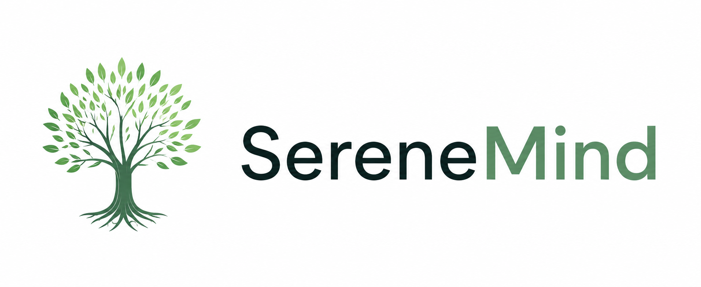

# mental-health-monitoring
# SereneMind: Intelligent Mental Health Monitoring System
**A Minor Project Report Submission**

 >
> * **Course:** [Bachelors in Comouter Engineering]
> * **Semester/Year:** [6th Semester, 3rd Year]
> * **University/College:** [Kathmandu Engineering College]
> * **Submission Date:** [2026]

---

## 👥 Project Team
* **[Abhipsa Nepal]** – [KAT080BCT006]
* **[Abisha Dhungel]** – [KAT080BCT007] 
* **[Anusesh Ghimire]** – [KAT080BCT016] 
* **[Ayush Gyawali]** – [KAT080BCT023] 

**Project Guide / Supervisor:** [Er. Krista Byanju]

---

## 📑 Abstract
In today's fast-paced world, mental health monitoring is crucial. **SereneMind** is a conceptual full stack web application developed as a minor project to address the need for an accessible, intuitive, and stigma-free mental health tracking tool. The system provides a calming user interface (UI) and smooth user experience (UX) to help users log daily moods, maintain private journal reflections, and access quick mindfulness tools. 

## 🎯 Project Objectives
1. **Design a Calming UI/UX:** To develop a front-end interface utilizing color psychology (soft greens and off-whites) to promote user relaxation.
2. **Implement Mood Tracking:** To create an interactive daily wellness snapshot for users to log their emotional state.
3. **Develop a Reflective Journaling System:** To build a structured, distraction-free environment for user journaling and self-reflection.
4. **Prototype AI Integration (Conceptual):** To design an interface for an intelligent chatbot assistant that can be scaled with a backend LLM in future iterations.

---

## 🌟 Key Features

* **Daily Wellness Snapshot:** Interactive emoji-based mood tracker.
* **Journal Feed & Entry Interface:** A dedicated space to view past entries and a full-page, distraction-free environment for writing new reflections with tagging capabilities.
* **AI Chatbot Assistant:** A dedicated interface for an intelligent assistant designed to provide support and prompt reflections.
* **Personal Insights Engine:** A dynamic UI component designed to display automated feedback based on user logs.
* **Quick Tools:** Easy access to immediate relief exercises, such as breathing techniques.

---

## 🛠️ Technology Stack (Front-End)

* **HTML5:** For semantic structure and content mapping.
* **Tailwind CSS (via CDN):** For rapid, utility-first styling and responsive layout management.
* **JavaScript (Vanilla):** For DOM manipulation and lightweight interactivity (e.g., mood selector state changes).
* **Google Fonts:** "Inter" typeface for modern readability.
* **FontAwesome (CDN):** For scalable vector icons.
* **Database Integration:** Utilizing Node.js/Express and MongoDB to securely store user credentials and journal entries.
* **Data Analytics:** Implementing `Chart.js` to render actual user stress and mood trends over time.
* **LLM Integration:** Connecting the chatbot interface to an OpenAI or Gemini API to provide real-time, context-aware mental health support.

---

## 🚀 How to Run the Project Locally

Because this phase of the project focuses on UI/UX and front-end development, no backend server setup is required.

1. **Extract the Project:** Unzip the project folder containing the source files.
2. **Directory Structure:** Ensure the following files are in the same folder:
    * `index.html` (The main dashboard view)
    * `image_4d75ee.jpg` (The SereneMind logo)
    * `plants-bg.jpg` (The decorative background image)
3. **Execution:** Double-click the `index.html` file to open the application in any modern web browser (Google Chrome, Mozilla Firefox, or Microsoft Edge).

---

# Frontend Implementation Documentation: SereneMind
**Date:** June 4, 2026

## Presented By:
* **Abisha Dhungel**
**Project Guide / Supervisor:** Er. Krista Byanju

---

## 1. Overview
This document details the front-end architecture, user interface (UI) design, and technical implementation of the SereneMind project as completed to date. The primary goal of this phase is to deliver a stigma-free, calming, and intuitive interface for mental health tracking, ensuring the application supports interactive operations while maintaining a user-friendly experience.

## 2. Technology Stack (Front-End)
The front-end utilizes a lightweight, modern technology stack to ensure rapid development and high performance.
* **HTML (Hyper Text Markup Language):** Used as the standard markup language to create the foundational structure of the web application.
* **CSS (Cascading Style Sheets):** Used to describe the presentation, layout, colors, and fonts of the HTML elements to create an attractive and user-friendly interface.
* *Note: Tailwind CSS via CDN was specifically utilized for utility-first rapid styling and layout management.*
* **JavaScript:** Employed as a high-level, interpreted programming language to make the web pages interactive, enabling dynamic content and responsive elements.
* **Visual Studio Code (VS Code):** Utilized as the primary lightweight and powerful source code editor for development.
* **Google Fonts:** The "Inter" font family is imported for clean, highly legible modern typography.
* **FontAwesome (via CDN):** Utilized for scalable vector icons throughout the navigation and tool interfaces.

## 3. Core Component Implementation

### 3.1 Daily Wellness Snapshot (Mood Tracker)
The mood tracker is designed to allow individuals to monitor their moods and emotional well-being on a daily basis.
* **UI Layout:** Flexbox is used to space five distinct emoji containers evenly across the component.
* **Interactivity:** Custom JavaScript handles the selection state `onclick`. It resets all mood containers by removing active classes, identifies the clicked element to enlarge the emoji and bring it to full opacity, and dynamically reveals the corresponding text label.

### 3.2 Journal Feed & Entry Interface
The journaling functionality enables users to write down their ideas, enhancing emotional clarity and self-reflection.
* **Feed Cards:** Past journal entries are displayed as stacked cards. The design aligns the date, title, preview text, and tags clearly for quick scanning.
* **Entry Form:** The new reflection area uses custom-styled inputs that transition border colors on focus, providing a distraction-free environment for users to express daily thoughts comfortably.

### 3.3 AI Chatbot Assistant (Interface)
The system includes the front-end structure for an intelligent chatbot designed to promote user interaction and offer real-time support.
* **UI Structure:** The interface mimics a standard messaging application, utilizing custom border-radius manipulation for chat bubbles and an input field with an integrated send button.
* **Future Integration:** This interface acts as the visual foundation for the future integration of backend natural language processing systems that will provide journaling prompts and self-care resources.

### 3.4 Personal Insights & Visualizations
To help users understand their emotional patterns and the significance of mental wellness, the interface includes sections dedicated to data insights.
* **Feedback Display:** A high-contrast banner draws attention to automated, rule-based feedback regarding the user's logged stress levels.
* **Chart Placeholders:** Layout spaces are established for future graphical representations, such as line charts or trend graphs, which will visualize stress and emotional patterns for better understanding.

## 4. Responsive Design Strategy
The application is entirely mobile-responsive, relying on a mobile-first breakpoint system:
* **Grid System:** The main content wrapper switches from a single-column layout on mobile to a multi-column CSS Grid on larger screens, ensuring accessibility across different devices.
* **Background Integration:** The botanical background graphic utilizes `mix-blend-mode: multiply` in CSS to seamlessly integrate the image with the application's soft gray background, ensuring visual consistency without clashing colors.
